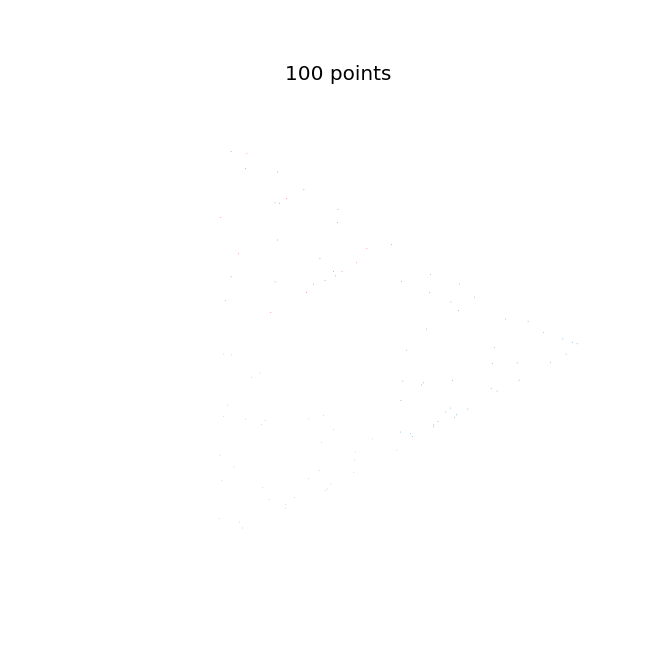
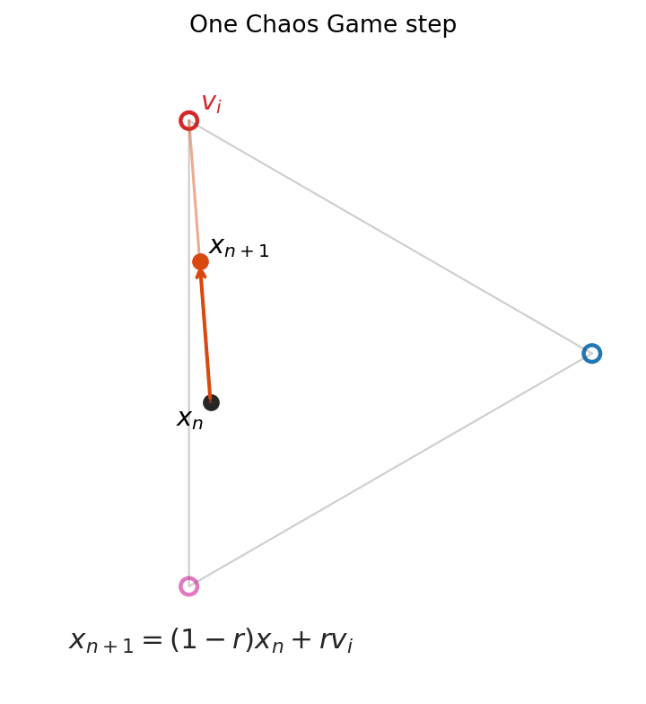
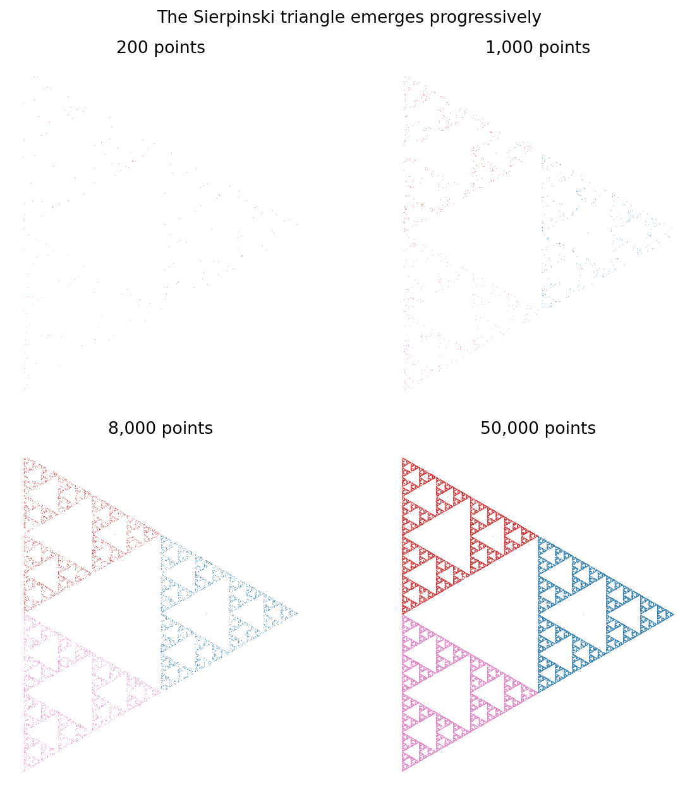
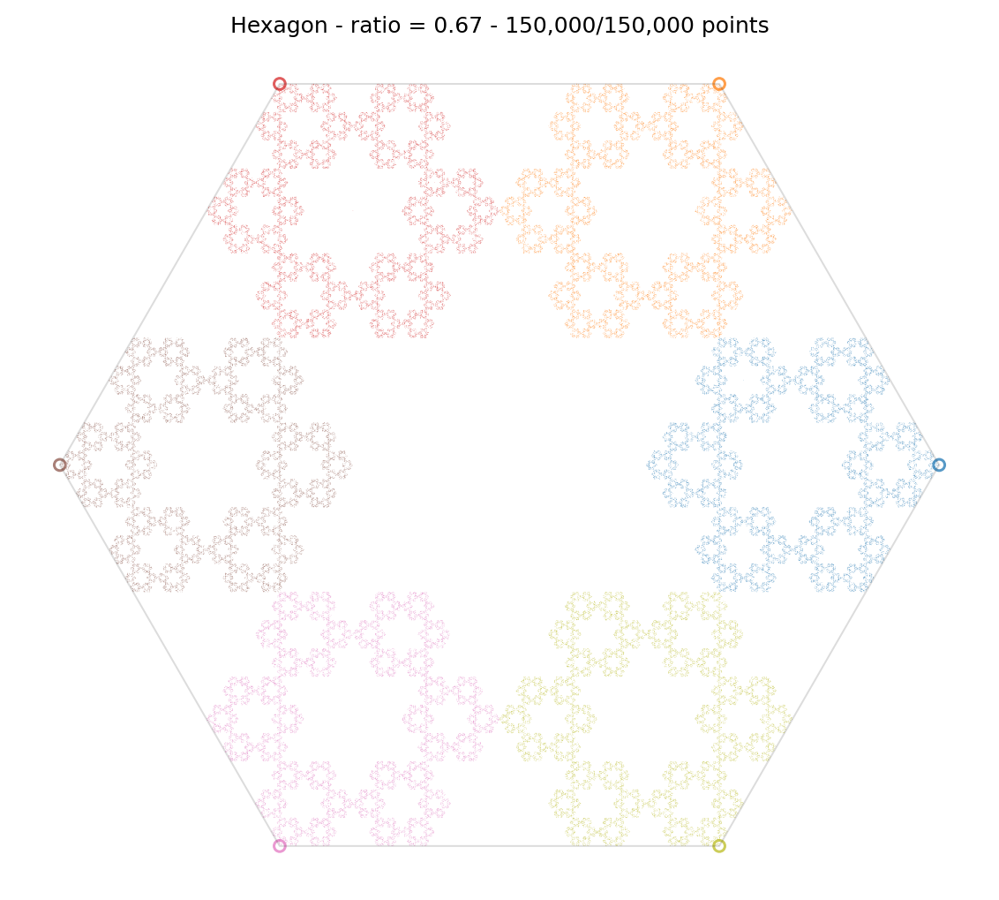

# Chaos Game / Polygon Fractals

An interactive Streamlit application for exploring the Chaos Game on regular
polygons. The app can render the point cloud directly, color each point by the
vertex selected at that step, and animate the construction so the fractal
appears progressively.



## Run the App

```bash
python3 -m venv .venv
.venv/bin/pip install -r requirements.txt
.venv/bin/streamlit run app.py
```

## Project Structure

```text
app.py                         Streamlit interface only
src/chaos_game.py              mathematical generation logic
src/plotting.py                Matplotlib rendering helpers
scripts/generate_readme_media.py
docs/media/                    generated README images and GIF
```

## Mathematical Idea

Choose a polygon with vertices:

```text
V = {v_1, v_2, ..., v_k}
```

Start from an initial point `x_0`, often the centroid of the polygon. At each
iteration:

1. choose one vertex `v_i` at random;
2. move the current point toward that vertex by a fixed ratio `r`;
3. draw the new point.

The recurrence is:

```text
x_{n+1} = (1 - r) x_n + r v_i
```

Here, `r` is the ratio controlled by the slider in the app. With a triangle and
`r = 0.5`, this process produces the Sierpinski triangle.



## Why a Fractal Appears

Each possible vertex defines a contraction map:

```text
f_i(x) = (1 - r)x + r v_i
```

Because `0 < r < 1`, each map pulls points closer to one vertex. Repeated random
application of these contractions sends the point toward the attractor of the
iterated function system. The randomness changes the order in which the points
are visited, but the long-term shape is stable.

For the triangle with `r = 0.5`, the contractions map the full triangle into
three smaller triangles. The middle region is never reached, then the same gap
structure repeats at smaller scales.



## Color by Selected Vertex

The app stores both the generated point and the index of the vertex chosen for
that step. When color mode is enabled, points are colored by this vertex index.
This makes the local construction rule visible in the final image.



## Regenerate the README Media

The images and GIF in `docs/media/` are generated by a script:

```bash
.venv/bin/python scripts/generate_readme_media.py
```

The script uses deterministic random seeds, so repeated runs produce stable
documentation assets.
