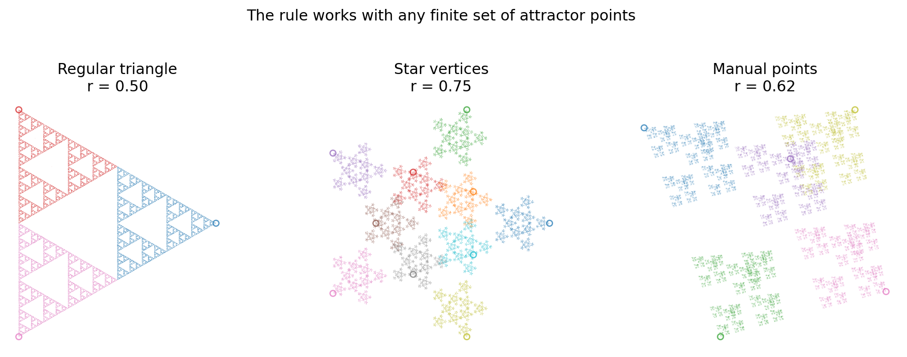
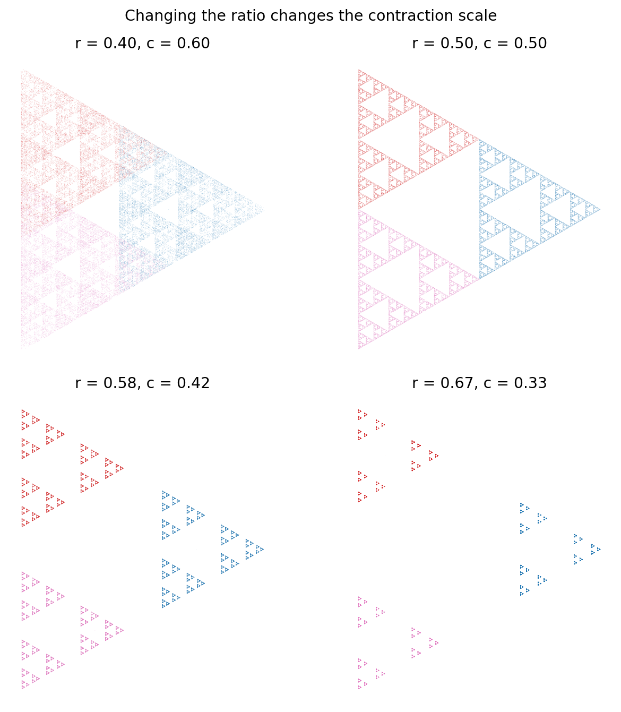
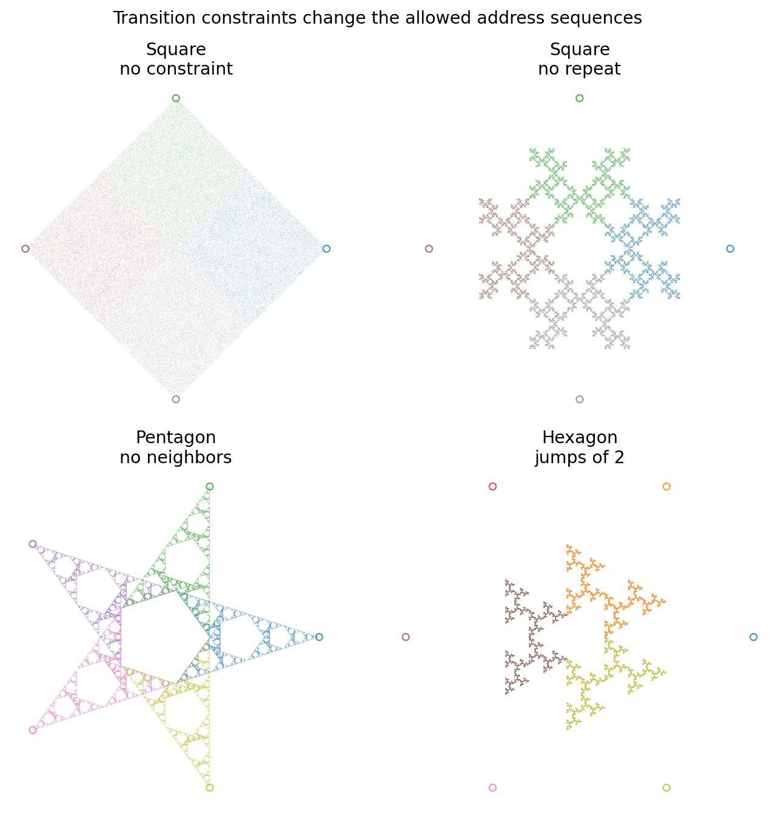

# Chaos Game / Polygon Fractals

An interactive Streamlit application for exploring the Chaos Game with regular
polygons, star-shaped vertex sets, and manually placed attractor points. The app
renders the point cloud, colors each generated point by the vertex selected at
that step, and can animate the construction so the fractal appears progressively.


## Live Demo

Try the app online: https://chaos-game.streamlit.app/

## Run the App

```bash
python3 -m venv .venv
.venv/bin/pip install -r requirements.txt
.venv/bin/streamlit run app.py
```

## Project Structure

```text
app.py                         Streamlit interface only
src/chaos_game.py              mathematical generation logic
src/plotting.py                Matplotlib rendering helpers
scripts/generate_readme_media.py
docs/media/                    generated README images and GIF
```

## App Controls

The left panel controls the vertex set, rendering options, and animation
settings. The main area displays either the generated fractal or the manual
placement canvas.

Available vertex sources:

```text
Regular polygon   triangle, square, pentagon, hexagon, ...
Star              alternating outer and inner vertices
Manual points     click on the canvas to place attractor points
```

The app starts with `150,000` points by default. The star mode defaults to:

```text
tips = 5
inner radius = 0.45
ratio = 0.75
```

Manual mode starts empty. Click on the placement canvas to add vertices, then use
`Generate` or `Animate`. `Undo last point` removes the latest clicked point, and
`Clear all points` resets the manual set.

The `Transition rule` control can restrict the next selected vertex:

```text
None                    any vertex can be chosen
No same vertex twice    the previous vertex cannot be selected again
No neighboring vertex   the two cyclic neighbors of the previous vertex are forbidden
Only jumps of N         from vertex i, only i-N and i+N are allowed
```

These constraints are useful because they modify the random walk without changing
the contraction formula. On squares, stars, and custom point sets, a constraint
can reveal structure that would otherwise be hidden by heavy overlap.
Rules that need a meaningful cyclic neighborhood, such as `No neighboring
vertex` and `Only jumps of N`, are only offered when the current vertex set has
enough points.

## The Chaos Game Rule

Choose a set of attractor points:

$$
V = {v_1, v_2, ..., v_k}
$$

Start from an initial point $P_0$, often the centroid of the vertices. At each
iteration:

1. choose one vertex $S$ at random;
2. move the current point toward $S$ by a fixed ratio $r$;
3. draw the new point.

The update rule is:

$$P_{n+1} = (1 - r) P_n + r S$$

For example, with $r = 2/3$, the update is:

$$P_{n+1} = (1/3) P_n + (2/3) S$$

This is exactly the same rule: the new point keeps $1/3$ of the old position and
takes $2/3$ of the selected vertex position.

The same rule is applied repeatedly. The first two updates are:

$$P_1 = (1 - r) P_0 + r S_1$$

$$P_2 = (1 - r) P_1 + r S_2$$


## Why a Fractal Appears

For a fixed selected vertex $S$, the map

$$
f_S(P) = (1 - r) P + r S
$$

is a contraction. If two starting points are separated by a distance $D$, their
images under the same map are separated by:

```math
c \cdot D
```

where the contraction factor is:

$$
c = 1 - r
$$

Repeatedly choosing random vertices means repeatedly applying one contraction
from a finite family of contractions. This is an iterated function system. The
randomness changes the order in which points are visited, but the long-term
object is the attractor of that system.

For the classic triangle with $r = 1/2$, the process produces the Sierpinski
triangle. The full triangle is mapped into three half-size copies, leaving the
middle gap empty, then the same structure repeats at smaller and smaller scales.
The same contraction idea applies to stars and manually placed points, although
the resulting attractor may have less familiar symmetry.


## Beyond Regular Polygons

The Chaos Game does not fundamentally depend on regular polygons. It only needs
a finite set of attractor points and a rule that moves the current point toward
one of them. A regular polygon is just the most symmetric case.

That is why the same app can use:

```text
regular polygon vertices
star vertices
manually placed points
```

The visual symmetry changes, but the mechanism is the same: choose one target
point, apply a contraction toward it, draw the result, and repeat.



## IFS Theory

The mathematical object behind this is an iterated function system, usually
called an IFS. An IFS is a finite family of contraction maps:

```math
{f_1, f_2, ..., f_N}
```

Each map takes points from the plane back into the plane, and each one must
shrink distances by some factor smaller than $1$. In the app, the maps are:

```math
f_i(P) = (1 - r)P + r v_i
```

where $v_i$ is one of the chosen vertices or manually placed points.

Hutchinson's theorem says that such a finite family of contractions has a unique
non-empty compact attractor $A$. It is the set that satisfies:

```math
A = f_1(A) union f_2(A) union ... union f_N(A)
```

Informally: the final fractal is the set that is rebuilt from contracted copies
of itself. The Chaos Game works because random iteration of the maps almost
always lands on this attractor after enough steps. The early points depend on
the starting point, but the long-term cloud does not.

The maps do not have to be simple "move toward a point" maps. More general IFS
fractals use affine transformations:

```math
f_i(P) = A_i P + b_i
```

Here, $A_i$ is a contractive matrix and $b_i$ is a translation vector. The matrix
can scale, rotate, shear, or flatten space, as long as it shrinks distances
overall. This is how classic examples such as the Barnsley fern or fractal trees
are built: each branch, leaflet, or stem is produced by repeatedly applying one
of several contractive affine maps.

## Choosing the Ratio

The ratio $r$ controls how far each step jumps toward the chosen vertex. It also
controls the contraction scale $c = 1 - r$.

Small $r$ values make small moves. The copies overlap heavily, so the image can
look dense, soft, or almost filled.

Values near the classical ratio often reveal clean self-similar structure. For a
triangle, $r = 1/2$ gives the Sierpinski triangle.

Large $r$ values jump closer to the selected vertex. The contraction scale is
smaller, so copies separate more strongly and the image becomes more sparse.



There is no universally best ratio. Good values depend on the number of
vertices and the kind of structure you want:

```text
triangle:  r = 0.50 is the classical Sierpinski case
square:    r around 0.50 often overlaps; other rules are usually needed for a clean carpet
pentagon:  r around 0.50 can produce star-like internal structure
hexagon:   r = 2/3 gives c = 1/3, a useful scale for six separated copies
star:      r around 0.75 often gives a crisp, separated structure
manual:    start near 0.50-0.70, then adjust based on overlap
```

The important point is that $r$ is the movement ratio, while $c = 1 - r$ is the
geometric scaling factor used in dimension formulas.

## Constrained Chaos Games

The unconstrained Chaos Game chooses each next vertex independently. With
constraints, the next choice depends on the previous vertex. For example:

```text
No same vertex twice:  after i, every vertex except i is allowed
No neighboring vertex: after i, the cyclic neighbors i-1 and i+1 are forbidden
Only jumps of N:       after i, only i-N and i+N are allowed
```

This adds memory to the random walk. The geometric maps are still contractions,
but not every sequence of maps is allowed anymore. The allowed sequences can be
described by a transition matrix:

```math
T_{ij} =
\begin{cases}
1 & \text{if a jump from vertex } i \text{ to vertex } j \text{ is allowed} \\
0 & \text{otherwise}
\end{cases}
```

At each step, the current vertex index is a state. The transition matrix tells
which states can follow. This is why constraints can reveal new structure: they
remove whole families of symbolic addresses from the attractor.



The constrained version is closely related to graph-directed IFS theory. Instead
of one attractor made from all maps freely composed, the system has states and
allowed edges between states. Each edge says which contraction may follow which
previous contraction. The final picture is still produced by repeated
contractions, but the combinatorics of allowed paths changes the visible
fractal.

For dimension, the unconstrained formula

```math
d = log(N) / log(1 / c)
```

is no longer generally enough. If the maps have a common contraction scale `c`
and the transition graph is clean enough, the number of allowed symbolic paths
is governed by the spectral radius `rho(T)` of the transition matrix. The
corresponding heuristic dimension is:

```math
d \approx log(rho(T)) / log(1 / c)
```

This should be treated carefully: overlaps, non-uniform probabilities, and
non-identical contraction ratios can change the true dimension. But it gives the
right intuition: constraints reduce the number of admissible paths, and that can
lower or reshape the fractal.

## Fractal Dimension

A smooth line has dimension $1$; a filled region has dimension $2$. A fractal
attractor often lands between these values. For a self-similar set made of $N$
non-overlapping copies, each scaled by the same factor $c$, the similarity
dimension $d$ satisfies:

```math
N c^d = 1
```

Solving for $d$ gives:

```math
d = log(N) / log(1 / c)
```

For the Sierpinski triangle:

```math
N = 3
c = 1/2
d = log(3) / log(2) ~= 1.585
```

For a six-copy construction with scale $c = 1/3$:

```math
N = 6
c = 1/3
d = log(6) / log(3) ~= 1.631
```

This corresponds to the kind of update:

```math
P_{n+1} = (1/3) P_n + (2/3) S
```

because $r = 2/3$, so $c = 1 - r = 1/3$.

This formula is exact for clean self-similar constructions where the scaled
copies do not overlap in a dimension-changing way. In the general polygon Chaos
Game, overlap can happen. When copies overlap strongly, the simple formula may
overestimate the true dimension, and the attractor may become closer to a filled
two-dimensional region.

## Color by Selected Vertex

The app stores both the generated point and the index of the vertex chosen for
that step. When color mode is enabled, points are colored by this vertex index.
This makes the local construction rule visible in the final image.


## Regenerate the README Media

The images and GIF in `docs/media/` are generated by a script:

```bash
.venv/bin/python scripts/generate_readme_media.py
```

The script uses deterministic random seeds, so repeated runs produce stable
documentation assets.

## Sources

- John E. Hutchinson, ["Fractals and self similarity"](https://doi.org/10.1512/iumj.1981.30.30055), Indiana University Mathematics Journal, 1981.
- R. Daniel Mauldin and S. C. Williams, ["Hausdorff dimension in graph directed constructions"](https://www.ams.org/tran/1988-309-02/S0002-9947-1988-0961615-4/), Transactions of the AMS, 1988.
- Wolfram MathWorld, ["Chaos Game"](https://mathworld.wolfram.com/ChaosGame.html).
- Wolfram MathWorld, ["Barnsley's Fern"](https://mathworld.wolfram.com/BarnsleysFern.html).
- Wikipedia, ["Chaos game"](https://en.wikipedia.org/wiki/Chaos_game), especially the restricted chaos game examples.
- Wikipedia, ["Iterated function system"](https://en.wikipedia.org/wiki/Iterated_function_system), for a compact overview of IFS terminology.
